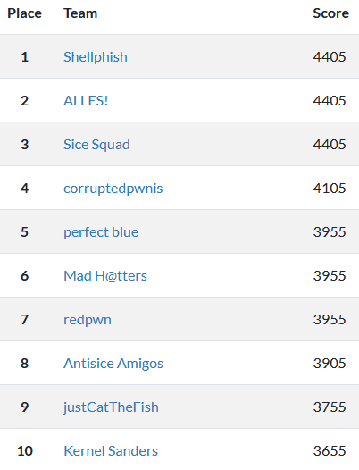
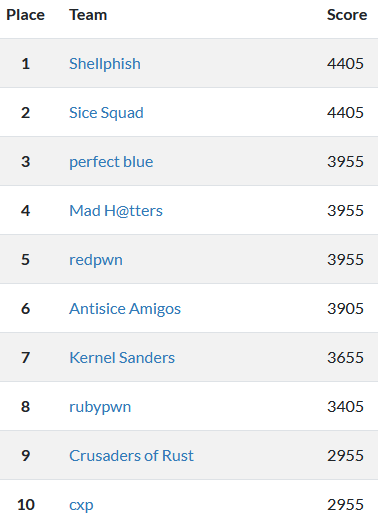

# CSAW-CTF-Quals-2020
**Team: Mad H@tters**  
  
### Scoreboard (Everyone | Undergraduate, US-Canada Region)



## How to Contribute
1. Solve a challenge
2. Make a folder with the challenge name
    * Use hypen (-) if it contains spaces
3. Dump all of your work for the challenge into the new folder
4. Create a challenge `README.md` for your folder (see below)

```
# [Full Challenge Name]

[Category]  
[NUM] Points  
Contributor: [Names who solved this challenge]
```

5. Push the changes to the new branch with the challenge names
6. Create a PR (pull request) to merge it to the `master` branch